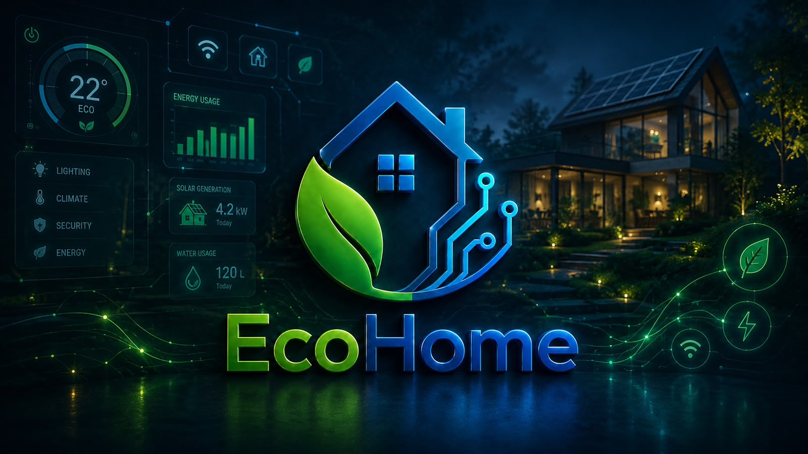

<p align="center">
  
</p>

<p align="center">
  
</p>

<p align="center">
  
  
  
</p>

<p align="center">
  <strong>Plataforma inteligente para monitoreo de recursos, automatización, IoT y seguridad del hogar.</strong>
</p>

<p align="center">
  
  
  
</p>

> 🎓 **Origen académico:** EcoHome nació como proyecto final de **Ingeniería de Requisitos (ISO-500)** en la **Universidad APEC (UNAPEC)** durante el período **Septiembre - Diciembre 2024**. La versión `1.1.0` conserva ese origen y lo evoluciona a un proyecto full-stack funcional, reproducible y mantenible.

---

## ✨ Qué es EcoHome

EcoHome centraliza la administración de un hogar inteligente: usuarios, habitaciones, dispositivos IoT, consumo de electricidad/agua/gas, seguridad, alertas, automatizaciones, analítica histórica, recomendaciones y simulación de telemetría.

La aplicación está diseñada con separación de responsabilidades y módulos independientes para facilitar mantenimiento, pruebas y evolución futura.

### 📌 Estado y alcance

EcoHome se mantiene deliberadamente como **proyecto académico evolucionado y proyecto de portafolio**. Su objetivo es demostrar arquitectura full-stack, integración IoT, seguridad, automatización, pruebas y prácticas DevOps; no se presenta como un servicio comercial ni como una plataforma pública con SLA.

La configuración incluida prioriza una experiencia local reproducible. Antes de exponer el sistema a Internet deben endurecerse secretos, hosts, TLS y especialmente la autenticación/ACL del broker MQTT, tal como se documenta en [`SECURITY.md`](SECURITY.md).

## ✅ Capacidades de la versión 1.1

- 🔐 Registro, autenticación JWT y perfiles.
- 🏠 Hogares multiusuario con roles y aislamiento de datos.
- 🚪 Habitaciones y catálogo de dispositivos inteligentes.
- 📡 Comunicación MQTT, listener de telemetría y comandos remotos.
- ⚡ Monitoreo de energía, 💧 agua y 🔥 gas.
- 🎯 Límites de consumo, umbrales e históricos.
- 🚨 Alertas y reglas de automatización con cooldown e historial de ejecución.
- 🛡️ Modos de seguridad, cámaras, sensores de movimiento/puerta y eventos.
- 📊 Dashboard, KPIs, tendencias y exportación CSV.
- ✨ Recomendaciones inteligentes basadas en consumo, conectividad y seguridad.
- 🧪 Simulador IoT reproducible para probar el sistema sin hardware físico.
- 🐳 Entorno completo con Docker Compose, PostgreSQL, Mosquitto, Gunicorn y Nginx.
- ✅ CI para Django, React/TypeScript, pruebas frontend, auditoría npm y validación de infraestructura.
- ♿ Mejoras de semántica accesible en autenticación.
- 🔄 Dependabot para mantenimiento periódico de dependencias.

### 🆕 Novedades incorporadas en `v1.1.0`

- 🧪 **Pruebas automatizadas de componentes React** para validar el flujo de inicio de sesión y los estados visuales de dispositivos IoT.
- ♿ **Autenticación más accesible**, con mensajes de error anunciables, estados de carga expuestos correctamente a tecnologías de asistencia y mejor semántica del formulario.
- 🧹 **Aislamiento determinístico de pruebas frontend**, limpiando el DOM entre casos para evitar interferencias y falsos positivos.
- 🛡️ **Quality gate frontend** mediante `npm run check`, combinando typecheck, pruebas automatizadas y build de producción.
- 🔍 **Auditoría automática de dependencias npm de producción** integrada en GitHub Actions.
- 🔄 **Actualización automática de dependencias con Dependabot** para pip, npm, GitHub Actions y Docker.
- ⚙️ **Entorno CI estabilizado** con versiones compatibles de npm, Vitest y jsdom para mantener builds reproducibles con Vite 8.
- ✅ **Validación completa de cada cambio**: backend Django, migraciones, pruebas Python, frontend React/TypeScript, auditoría de dependencias y configuración Docker Compose.
- 🧰 **Base preparada para pruebas manuales y regresión**, permitiendo concentrar la siguiente etapa del proyecto en detección y corrección de errores sin ampliar el alcance funcional.

---

## 🧱 Arquitectura

```text
React 19 + TypeScript + Vite
             │
             │ HTTPS / JSON
             ▼
Django 5 + DRF + SimpleJWT
             │
      ┌──────┴───────┐
      ▼              ▼
 PostgreSQL       MQTT / Mosquitto
                     │
                     ▼
               Dispositivos IoT
```

El backend está organizado en aplicaciones Django modulares: `accounts`, `homes`, `devices`, `iot`, `resources`, `automation`, `security`, `reports`, `recommendations`, `simulator`, `dashboard` y `core`.

Documentación ampliada: [`docs/ARCHITECTURE.md`](docs/ARCHITECTURE.md).

---

## 🛠️ Stack tecnológico real

### ⚙️ Backend

<p>
  
</p>

- Python 3.13
- Django 5.2
- Django REST Framework 3.17
- SimpleJWT
- Gunicorn
- Paho MQTT

### 🎨 Frontend

<p>
  
</p>

- React 19
- TypeScript 7
- Vite 8
- Vitest
- Testing Library
- Nginx para producción/demo contenedorizada

### 🗄️ Datos e IoT

<p>
  
  
</p>

- PostgreSQL 16
- Eclipse Mosquitto 2
- MQTT

### 🧰 DevOps

<p>
  
</p>

- Docker / Docker Compose
- GitHub Actions
- Dependabot
- Health/readiness checks

---

## 🚀 Ejecutar con Docker

```bash
git clone https://github.com/Jairo0811/EcoHome.git
cd EcoHome
cp .env.example .env
docker compose up --build -d
```

Abre `http://localhost:8080`.

Verifica los servicios:

```bash
docker compose ps
curl http://localhost:8080/api/v1/health/
curl http://localhost:8080/api/v1/health/ready/
```

Para apagar:

```bash
docker compose down
```

Consulta [`docs/DEPLOYMENT.md`](docs/DEPLOYMENT.md) antes de cualquier despliegue externo.

---

## 🧪 Desarrollo y pruebas

### ⚙️ Backend

<p>
  
</p>

```bash
cd backend
python -m venv .venv
# Windows: .venv\Scripts\activate
# Linux/macOS: source .venv/bin/activate
pip install -r requirements.txt
python manage.py migrate
python manage.py test
python manage.py runserver
```

### 🎨 Frontend

<p>
  
</p>

```bash
cd frontend
npm install
npm run typecheck
npm run test
npm run build
npm run dev
```

También puedes ejecutar el quality gate local completo:

```bash
npm run check
```

El CI ejecuta system checks de Django, verificación de migraciones, migraciones, compilación Python, tests backend, typecheck TypeScript, tests frontend, auditoría de dependencias npm de producción, build Vite y validación de Docker Compose.

---

## 📡 IoT y simulador

Tópicos MQTT principales:

```text
ecohome/{home_id}/devices/{external_id}
ecohome/{home_id}/devices/{external_id}/commands
```

Listener:

```bash
cd backend
python manage.py run_mqtt_listener
```

Simulador:

```bash
python manage.py simulate_iot --home 1 --steps 10 --seed 42
```

El simulador utiliza el mismo pipeline de ingesta que los dispositivos reales, por lo que alimenta dashboards, límites, alertas y automatizaciones.

---

## 🔌 API

La API vive bajo `/api/v1`. Sus áreas principales son:

```text
/auth/
/homes/
/rooms/
/devices/
/telemetry/
/iot/
/resources/
/automation/
/security/
/reports/
/recommendations/
/simulator/
/dashboard/
/health/
```

Referencia ampliada: [`docs/API.md`](docs/API.md).

---

## 🔒 Seguridad

EcoHome aplica autorización por hogar, JWT, throttling de API, configuración segura por variables de entorno, cookies seguras según entorno, HSTS configurable, protección contra framing/sniffing y ejecución no-root del backend en contenedores.

El broker MQTT incluido en Compose permite conexiones anónimas para facilitar desarrollo local; **debe configurarse con autenticación, ACL y TLS antes de exponerlo en producción**. Consulta [`SECURITY.md`](SECURITY.md).

---

## 🎓 Información académica

| Información | Detalle |
|---|---|
| 🏢 Empresa académica | **Soluciones Tech** |
| 📖 Asignatura | **Ingeniería de Requisitos (ISO-500)** |
| 👨‍🏫 Profesor | **Ing. Eddy G. Alcantara Solano** |
| 🏫 Institución | **Universidad APEC (UNAPEC)** |
| 📅 Período académico | **Septiembre - Diciembre 2024** |
| 📁 Tipo de entrega | **Proyecto Final** |

### 👥 Equipo académico original

| 👤 Integrante | 🆔 Matrícula |
|---|---|
| 👨🏻‍💻 Andrés Beltré | A00113462 |
| 👨🏻‍💻 Rafael Antonio De Leon Dominguez | A00113515 |
| 👨🏻‍💻 Francis Jairo Matías Rosario | A00115261 |

### 🧭 Continuidad académica

La continuidad se documenta únicamente cuando existe una coincidencia verificable por estudiante o profesor. Dentro de los proyectos actualmente documentados no se ha verificado una segunda coincidencia inequívoca de Andrés Beltré o Rafael Antonio De Leon Dominguez con Francis Jairo Matías Rosario, ni una segunda asignatura con **Ing. Eddy G. Alcantara Solano**.

---

## 🗺️ Evolución completada

| Fase | Resultado |
|---|---|
| 0 | Recuperación, análisis y planificación |
| 1 | Base full-stack y dashboard inicial |
| 2 | Autenticación e identidad |
| 3 | Hogares, habitaciones, miembros y dispositivos |
| 4 | MQTT, IoT y telemetría |
| 5 | Recursos: electricidad, agua y gas |
| 6 | Alertas y automatizaciones |
| 7 | Seguridad inteligente |
| 8 | Analítica, históricos y reportes |
| 9 | Recomendaciones inteligentes |
| 10 | Simulador IoT |
| 11 | Hardening, CI y despliegue reproducible |
| 12 | UI/UX final, documentación y `v1.0.0` |
| 13 | Quality hardening: tests frontend, accesibilidad, auditoría y mantenimiento · `v1.1.0` |

**EcoHome 1.1 está funcionalmente completo dentro del alcance definido como proyecto académico evolucionado y de portafolio.**

---

## 📚 Documentación

- [Arquitectura](docs/ARCHITECTURE.md)
- [API](docs/API.md)
- [Despliegue](docs/DEPLOYMENT.md)
- [Seguridad](SECURITY.md)
- [Historial de cambios](CHANGELOG.md)

---

<p align="center">
  <strong>EcoHome v1.1.0 · Universidad APEC (UNAPEC) · Proyecto académico evolucionado y proyecto de portafolio</strong>
</p>
